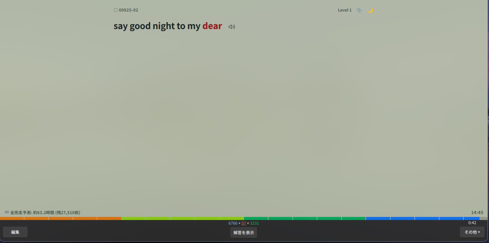
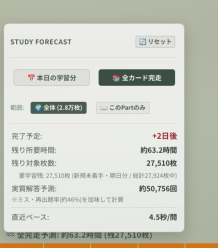

# anki-card-toolkit

Ankiカード用のモジュール式UI拡張・学習支援ツールキット。
キングジム風ビジュアルバータイマー、学習完了予測HUD、OLEDダークモード切替、単語ストック、辞書テキスト整形を含みます。

Anki Desktop、AnkiMobile（iOS）、AnkiDroid（Android）に対応。

  
  

  
  
  

## モジュール一覧

各機能は独立しており、必要なモジュール単体でも導入可能です。

| モジュール | 概要 | ディレクトリ |
| :--- | :--- | :--- |
| **Visual Bar Timer** | キングジム「ビジュアルバータイマープラス」風の20分割・4色プログレスバータイマー。ポモドーロ / 1問制限時間に対応。 | [`modules/01-visual-bar-timer`](modules/01-visual-bar-timer) |
| **Study Forecast** | 解答ペースと過去の誤答率から、本日の完了時刻や全カード走破までの所要時間をリアルタイム推定。 | [`modules/02-study-forecast`](modules/02-study-forecast) |
| **Theme Toggle** | ソフトグリーンとOLED漆黒ブラックのワンタップ切替。めくり時のフラッシュ防止。 | [`modules/03-theme-toggle`](modules/03-theme-toggle) |
| **Quick Clip** | 気になった単語をワンタップ保存。一覧表示とクリップボード一括コピーに対応。 | [`modules/04-quick-clip`](modules/04-quick-clip) |
| **Meaning Formatter** | 辞書CSVの意味欄記号（`＝`、`【品詞】`、`〔解説〕`など）を解析し、レイアウトを自動整形。 | [`modules/05-meaning-formatter`](modules/05-meaning-formatter) |
| **Full Pack** | 上記全機能を統合したテンプレート一式。 | [`full-pack`](full-pack) |

## クイックスタート (統合版)

全機能をまとめて導入する場合は、[`full-pack`](full-pack) のコードを使用してください。

1. Ankiのメニューから **「ツール」→「ノートタイプを管理」** を選択。
2. 対象のノートタイプを選択し、**「カード」** をクリック。
3. 各ファイルの内容をコピー＆ペースト：
   - 表面の書式: [`full-pack/front.html`](full-pack/front.html)
   - 裏面の書式: [`full-pack/back.html`](full-pack/back.html)
   - 書式 (CSS): [`full-pack/style.css`](full-pack/style.css)

特定の機能のみを利用したい場合は、各モジュールのディレクトリにあるREADMEを参照してください。

## 互換性

- Anki Desktop (24.x+, Qt5 / Qt6)
- AnkiMobile (iOS)
- AnkiDroid (Android)

## ライセンス

[MIT](LICENSE)
