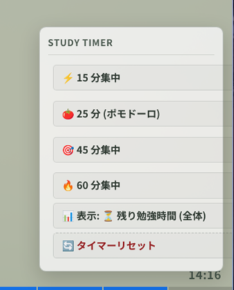

# Visual Bar Timer

キングジムのビジュアルバータイマー（VBT20）を模したプログレスバータイマー。画面最下部に固定表示されます。

  

## 仕様
- **4色セグメント (20分割)**: 残り時間に応じて青（75-100%）、緑（50-75%）、黄緑（25-50%）、橙（0-25%）に変化。
- **カードめくり時のチラつき防止**: 初回描画前に現在値を算出・適用（同期スクリプト）するため、カード遷移時のリセットやアニメーション飛びが発生しません。
- **2つのモード**:
  - セッション全体（15 / 25 / 45 / 60分）
  - 1問ごとの制限時間（8秒カウントダウン）
- **時間表示**: 右下に数値を表示。タップでタイマー設定パネルを開きます。

## ファイル
- `template.html`: 画面下部HUDとタイマー設定パネルのマークアップ
- `style.css`: バーとHUDのスタイル定義
- `script.js`: タイマー計算およびレンダリングロジック

## 導入
1. `template.html` をカードテンプレートの最下部に配置。
2. `style.css` をスタイルシート（CSS）に追加。
3. `script.js` をカードテンプレート末尾の `<script>` 内に追加。
