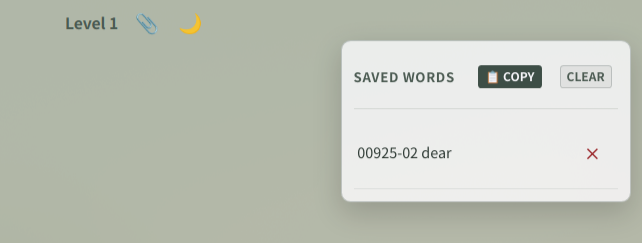

# Quick Clip

学習中のカード（番号と単語）を1タップでストックし、後からクリップボードへ一括書き出しできる機能です。

  

## 仕様
- **ワンタップ保存**: ヘッダーの `📎` を押すと保存され、フィードバックとしてアイコンが一瞬 `✅` に変化。
- **一覧表示**: 保存済みの状態で `📎` を押すとストック一覧パネルを展開。
- **一括コピー**: `📋 COPY` でクリップボードに改行区切りでコピー。Notionやテキストエディタにそのまま貼り付け可能。
- **個別削除 / 全消去**: リスト内の各項目削除および全削除に対応。

## ファイル
- `template.html`: クリップボタンおよびモーダルパネル
- `style.css`: パネルスタイル定義
- `script.js`: 保存・クリップボード書き出しロジック

## 導入
1. `template.html` をカードヘッダー部およびパネル配置部に追加。
2. `style.css` をスタイルシートに追加。
3. `script.js` を `<script>` に追加。
